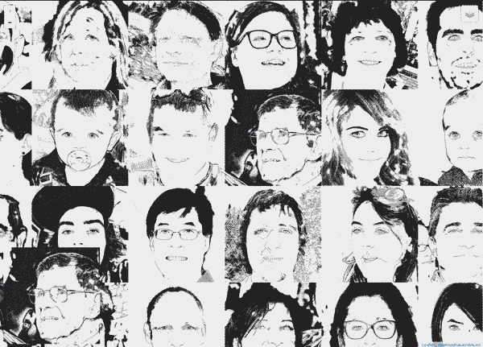

# NN based line art

An [interactive map](https://peko.github.io/nn-lineart/) that allows you to view the results of the work of neural networks and compare the quality

https://peko.github.io/nn-lineart/

## controls

- use 1,2,3 - to switch photo, artline, u2net

## models

- [U2Net](https://github.com/NathanUA/U-2-Net)
- [ArtLine](https://github.com/vijishmadhavan/ArtLine)
